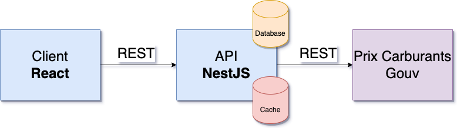

# Polysson (Programmable Web - Client & Server Side)


## Team members

- [Antoine Facq](https://github.com/AntoineFacq)
- [Alexandre Mazurier](https://github.com/Alexandre-MAZURIER)
- [Lucas Rakotomalala](https://github.com/LucasRakotomalala)
- [Loïc Rizzo](https://github.com/Loic-Rizzo)

## Execute the project

### Without `Docker`

#### Requirements

- Node (>= `16.4.0`  && ≠ `17.5.0`)

#### Command lines

- Server

  ```sh
  cd api
  npm i
  npm start
  ```

- Client

  ```sh
  cd client
  npm i
  npm start
  ```

### With `Docker`

#### Requirements

- Docker (>= `20`)

#### Command lines

##### Client and server in one container each

```sh
docker-compose up -d --build client
```

##### Client and server in one container together

```sh
docker-compose up -d --build app
```

## User guide

### Local

- Go to [http://localhost:3000/v1/api](http://localhost:3000/v1/api) to check the different endpoints available.
- Go [http://localhost:3000](http://localhost:3000) to access to the frontend **if you're using the client and server in one container together**, or [http://localhost:8080](http://localhost:8080) otherwise.

*Note: The startup can be a bit long : the server pushes data in the database after retrieving them from [https://www.prix-carburants.gouv.fr](https://www.prix-carburants.gouv.fr).*

### Online

- Go to [https://prog-web-team-fmrr.herokuapp.com/v1/api](https://prog-web-team-fmrr.herokuapp.com/v1/api) to check the different endpoints available.
- Go [https://prog-web-team-fmrr.herokuapp.com](https://prog-web-team-fmrr.herokuapp.com) to access to the frontend.

## Architecture



- We retrieve a zip file from *[https://www.prix-carburants.gouv.fr](https://www.prix-carburants.gouv.fr)* that we extract to obtain an xml file.
- We parse that xml file to create an object for each entry.
- Finally we push created objects to the database.
