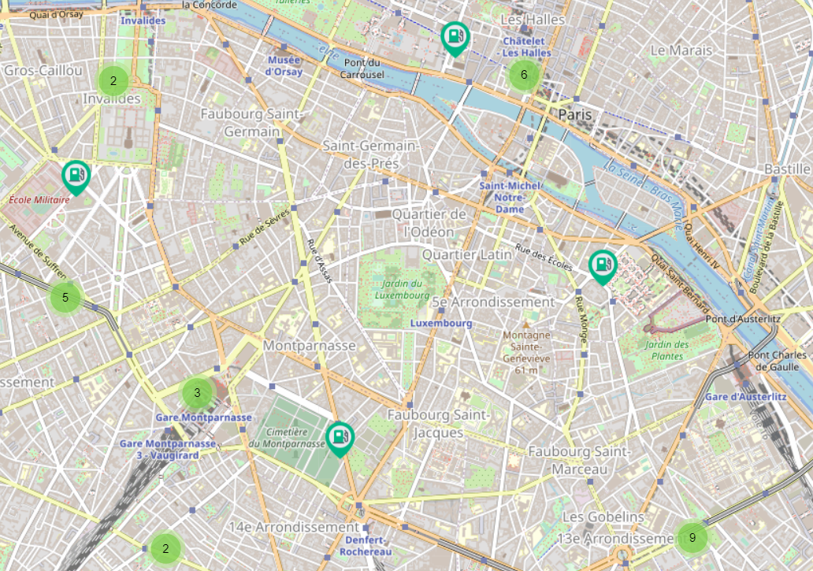
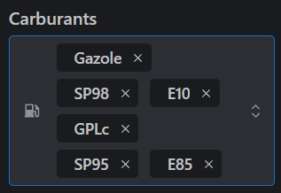

<h1 style=text-align:center>Rapport</h1>


## Programmable Web - Client side

Année 2021-2022  
GitHub : **AntoineFacq**  
Mail : **antoine.facq@etu.univ-cotedazur.fr**

### Stratégie employée pour la gestion des versions avec Git

Pour ce qui est de la gestion du projet via GitHub, nous avons opté pour la *branching strategy* suivante :

- *oringin/main* pour la version finale & stable du projet
- *origin/<feature-name>* pour chaque *feature* développée
- *origin/develop* pour rabattre via un *merge* les branches *features*

### Tâches effectuées

#### Implémentation de la carte (4 h)

#### *Solutions choisies*

Nous avons choisi ```react-leaflet``` puisqu’il s’agit de la seule librairie qui fournit sous forme de composants React
les nombreuses API que Leaflet propose.  
En effet, nous avons déjà utilisé Leaflet auparavant pour d’autres projets et nous voulions avoir un frontend
fonctionnel rapidement.

Il existe cependant d’autres librairies React qui permettent d’afficher une carte sur son frontend par le biais de
composants, comme ```react-map-glou``` encore ```@googlemaps/react-wrapper```.  
Malgré leur maintenance régulière, ces librairies ne sont pas des solutions complètement gratuites et open sources,
contrairement à ```react-leaflet```.



#### *Difficultés rencontrées*

Pour intercepter les évènements de la map et permettre le rafraichissement de celle-ci au fur et à mesure, il m'a été
compliqué d'y procéder :

- J'ai tout d'abord tenté de surcharger le composant ```MapContainer``` afin de permettre d'y ajouter un évènement.
- Ensuite, j'ai essayé d'utiliser le hook ```useMap()``` afin de récupérer la map et donc permettre d'obtenir un
  callback à chaque mouvement pour permettre la mise à jour des stations en fonction de la nouvelle position.

#### *Solutions / Blocages*

En utilisant un ```useEffect()``` avec une dépendance sur la ``map``, et en testant si elle est définie (a donc été
chargée), on a la possibilité de détecter un déplacement sur la carte, et donc la nécessité de mettre les stations à
jour.

#### Affichage des stations sur la carte (20mn)

#### *Solutions choisies*

Via ```react-leaflet```, il nous est permis d'afficher des point et de réaliser des clusters afin de ne pas encombrer
l'affichage. Ainsi, la lib permet de donner un icon qui sera utilisé pour représenter les stations

#### *Difficultés rencontrées*

#### *Impacts*

Les stations, qui sont stockées dans un *state*, doivent être rafraîchi dynamiquement lors de chaque modification d'un
filtre

#### *Solutions / Blocages*

#### Choix du rayon d'affichage (30mn)

#### *Solutions choisies*

Pour la distance d'affichage à la carte, nous avons choisi d'utiliser un *Slider* appartenant à la
librairie ```@mantine/core```
En effet, ce composasnt nous semblait le plus adapté pour permettre à l'utilisateur de sélectionner la distance du
centre à laquelle il veut afficher les stations.  
On peut rationnellement admettre qu'un composant *Select* ou qu'une *Input* aurait été un frein au bon enchainement des
interactions de l'utilisateur. Ainsi, avec le slider, l'utilisateur peut très rapidement réevaluer la distance et voir
directement l'impact en direct.

#### *Difficultés rencontrées*

Lorsque le rayon d'affichage est modifié, le state ```distance``` change, il faut alors trouver une solution pour
intercepter le changement du state après que les nouvelles valeurs aient été récupérées.

#### *Solutions / Blocages*

La méthode ```useEffect``` est très utile étant donné qu'elle permet d'appeler une fonction lambda suite au
rafraichissement du composant, lorsque le state a bien été modifié. Ainsi, on peut se baser sur la valeur de la distance
qui a bien été mise à jour pour ré-effectuer l'appel à l'API et récupérer ainsi les stations à la bonne distance

#### Filtre par carburant (30mn)

#### *Solutions choisies*

Il semblait intéressant de pouvoir filtrer les stations par carburant. On imagine que l'utilisateur disposant d'une
voiture est intéressé par un carburant particulier.

Ainsi, un radio button semblait approprié pour permettre facilement à l'utilisateur de filtrer les stations, soit :

- Tous (Filtre désactivé)
- Gazole
- SP95
- E85
- GPLc
- E10
- SP98

#### *Difficultés rencontrées*

En considérant que l'utilisateur pourrait utiliser soit du SP98, soit du SP95, il a été nécessaire de repenser le mode
de sélection des carburants. En utilisant simplement les composants natifs de React, les possibilités étaient limitées.

#### *Solutions / Blocages*

Ainsi, ```@mantine/core``` propose un choix multiple sous la forme de tags:  




### Commentaire de code
```jsx
<ConditionalWrapper
          condition={isClustering}
          wrapper={(children) => (
            <MarkerClusterGroup>{children}</MarkerClusterGroup>
          )}
        >
          {stations.map((station, index) => (
            <Marker
              key={index}
              icon={
                getCheapestStation() === getStationGazolePrice(station, gas)
                  ? iconCheapest
                  : icon
              }
              position={[station.position.latitude, station.position.longitude]}
            >
              <Popup>
                <div className={`leaflet-popup-content-${colorScheme}`}>
                  <b>{station.adresse}</b>
                  {station.prix ? (
                    <>
                      <Space h="xs" />
                      <List id="gasPrice" size="sm">
                        {station.prix.map((gasObj, index) => (
                          <List.Item key={index}>
                            {gasObj.nom}: {gasObj.valeur}€
                          </List.Item>
                        ))}
                      </List>
                    </>
                  ) : (
                    <></>
                  )}
                  {station.services ? (
                    <>
                      <Space h="xs" />
                      <List id="services" size="sm">
                        {station.services.map((service, index) => (
                          <List.Item key={index}>{service}</List.Item>
                        ))}
                      </List>
                    </>
                  ) : (
                    <></>
                  )}
                </div>
              </Popup>
            </Marker>
          ))}
        </ConditionalWrapper>
```

Dans le code ci-dessus, on imbrique la boucle d'affichage des stations dans un ``ConditionnalWrapper``
de manière conditionnelle. Ainsi, les stations seront clusterisées uniquement si la proriété ``isClustering`` vrai.  
Si c'est le cas, cela aura pour conséquence d'appliquer l'élément JSX ```MarkerClusterGroup``` uniquement si c'est nécessaire.
